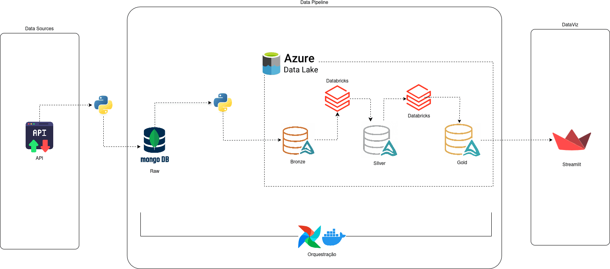

#  Pokedex Insights: Data Pipeline

Pokedex Insights é um projeto que tem como objetivo a construção de uma infraestrutura de dados end-to-end, implementando um pipeline ELT de ingestão e transformação sob o modelo de Data Lakehouse, utilizando como fontes de dados uma API open-source disponibilizada pela PokéAPI.

## 🏗️ Arquitetura do Pipeline de Dados

  

#### 1. Data Sources & Ingestion
- **API:** Fonte de dados open-source disponível em [PokéAPI](https://pokeapi.co/).
- **Python:** Script de extração que consome a API e carrega no MongoDB (Camada Raw).
- **MongoDB:** Banco de dados NoSQL utilizado para armazenar os documentos JSON provenientes da API.

#### 2. Data Pipeline (Azure & Databricks)
- **Orquestração:** Todo o fluxo é gerenciado pelo Apache Airflow rodando no Docker (via Astronomer).
- **Bronze Layer:** Ingestão dos dados brutos do MongoDB para o Azure Data Lake Storage Gen2 em formato JSON.
- **Silver Layer:** Processamento via Databricks (PySpark) para limpeza, tipagem e conversão para o formato Delta.
- **Gold Layer:** Tabelas agragadas e prontas para o consumo, também em formato Delta.

#### 2. DataViz
- **Streamlit:** Uma aplicação Python que consome os dados da camada Gold para exibir análises de forma interativa.

